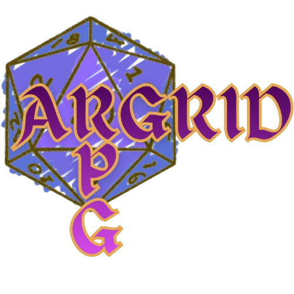

<p align="center">
  
</p>

# ARGrid — mobile PF2e tactical map (PWA)

A mobile-first PWA that **detects a grid of squares in a photo** (graph paper, a
tiled floor, a battle mat, a plexiglass grid…) and turns it into a **Pathfinder 2e
tactical map**: place creatures, draw area templates, and plan movement with the
game's real distance rules — all overlaid in AR style on your own photo.

> **Rule systems.** The tactical layer currently implements **Pathfinder 2e**
> (alternating-diagonal distances, area templates, reach/threat). It is built to
> grow into **other RPG systems** later — the geometry and the rules live in
> `src/overlays.ts`, separate from detection and rendering.

## How it works

1. Open the app — it opens the camera.
2. Frame a grid of squares (from above; slight tilt / rotation is OK) and **shoot**.
3. The app finds the rows and columns and overlays the complete grid (occluded /
   out-of-frame rows and columns are rebuilt and drawn slightly fainter). The result
   canvas is **zoomable** (wheel / pinch) and **pannable**.
4. Build your encounter with the floating **+ speed-dial** (bottom-right of the map)
   and the on-map **heads-up panel** (HUD) at the top:

### Pieces (creatures)

- Add **Alleato** (green) or **Nemico** (red) from the **+** menu, then tap cells to
  drop / remove them. Each piece is an *N×N* block (its creature size).
- Gestures on a piece: **tap = movement**, **long-press = edit** (size / speed /
  remove), **drag = reposition**.
- The trash, size and speed live in the HUD header/row while a piece is selected.

### Areas (spell / effect templates)

- Add **Area** from the **+** menu, tap a cell to drop it, then pick the type and
  size in the HUD. The affected **cells are coloured** (blue).
- **Emanazione** — measured from the creature with the PF2e alternating-diagonal
  rule (R=1 → 3×3; R=2 → a 5×5 with its four corners cut), with a creature size.
- **Esplosione** — from a grid **corner/intersection** (the tap picks the nearest);
  diagonals cost extra → 1 → 2×2, 2 → a cross, etc.
- **Cono** — a 90° sector of a burst from a **fixed chosen intersection**: a
  right-triangle staircase when diagonal, widening 2,4,6,8… when orthogonal.
- **Linea** — 1-cell-wide from the cell, snapping to the **four book slopes** (0°,
  1:3 ≈ 18.4°, 1:2 ≈ 26.6°, 45°), the same for every length.
- Lines and cones are **rotated on the map**: grab the handle at the shape's **tip**
  and turn — only the tip rotates it, so tapping elsewhere never moves it. Faint
  ticks mark the book orientations and the angle snaps to them.
- An area stays until you remove it with the **✕** (the same button that added it);
  taps elsewhere don't dismiss it — drag its origin to move it.

### Movement, threat & flanking

- Tap a piece to enter **movement**: reachable cells are banded by how many moves
  (up to 5) they cost, using PF2e alternating diagonals (1, 3, 4, 6, 7, 9 …).
- You pass through **your own side** but are blocked by the **opposite side**
  (barred with a red ✕).
- Tap a destination cell to preview routes: a **(movements ↔ threats) Pareto set** —
  the fastest route first (boldest), then each route that spends +1 movement to be
  threatened by **fewer distinct creatures**, down to 0 or the cap. The badge on each
  route is the number of threatening creatures met (counted **once per creature**,
  including the square you start on).
- During movement the **reach of both sides** is drawn (enemy red, ally green;
  contested cells get an alternating dashed border and a per-side counter).
- **Flanked** enemies (two allies threatening from opposite sides) get an amber
  dashed ring and a ⚔ marker.

Sizes are in cells (**q**), metres (**m**) or feet (**ft**) — **1 cell = 1.5 m = 5
ft** — chosen with the unit selector in the header.

### Controls & chrome

- **+ speed-dial** to add pieces / areas; while adding an area (or one is on the map)
  the **+** becomes an **✕** that removes it. Placement shows a short bottom toast.
- **Camera icon** (top-right) retakes the photo; **Scatta** appears only in camera
  mode.
- **Debug** has no visible switch: **triple-tap the logo** to toggle it — it overlays
  what the detector sees (Canny edge map + raw Hough lines in red) so you can tell
  *why* a photo fails (no edges → contrast/lighting; edges but no red lines → grid
  too small/weak).

## Grid detection

### Pipeline (`src/grid-detector.ts`)

grayscale → **CLAHE** (local contrast) → blur → **auto-Canny** (thresholds from
Otsu) → **adaptive Hough** (accumulator threshold proportional to image size,
self-tuning via retry) → **2-D grid-model fit** (below) → rebuild the complete grid.

The detector fits a **true 2-D lattice**, not a bag of independent lines:

1. **Split** the Hough lines into two families by nearest orientation — no hard
   angle cut-off, so a family that spreads under perspective never loses lines.
2. **Merge** the several Hough hits per real line into one, sign-safely across the
   0/180° wrap (OpenCV reports a near-axis line as `(+rho, θ≈0°)` or `(−rho, θ≈180°)`).
3. **Vanishing point per family by RANSAC** — keep only the lines that actually
   *concur* like a grid; text, drawings and stray marks that don't converge are
   rejected.
4. **Rectify** with the horizon (the line through both vanishing points): in the
   rectified plane the two families are parallel and evenly spaced.
5. **Fit a regular lattice** there (robust cell, global integer indexing, least-squares
   refit + outlier rejection) and **rebuild every row/column** — occluded ones
   included — then map the complete grid back into the image.

Both families are drawn in **one soft-white colour** (horizontals and verticals are
not distinguished). Rebuilt (interpolated) lines are drawn slightly fainter than
directly detected ones; detected lines keep their exact position.

Verified end-to-end against rendered grids: a strong-perspective 11×11 grid is
recovered in full, and a grid with dozens of noise scribbles is recovered cleanly
with the noise rejected.

## Develop

```bash
npm install
npm run dev
```

The camera requires a secure context (`https://` or `localhost`). To test on a phone,
expose the dev server with ngrok — `*.ngrok-free.dev` and `*.ngrok-free.app` are
already in Vite's `allowedHosts`:

```bash
ngrok http 5173
```

## Build, test & lint

```bash
npm run build && npm run preview   # production build + preview
npm test                           # Vitest unit tests (geometry + PF2e templates)
npm run lint                       # ESLint
```

## Architecture notes

- **OpenCV.js** (~11 MB, wasm embedded) is **vendored** at `public/opencv.js` and
  served from our own origin; the service worker precaches it, so it downloads
  **once** and then works offline. The service worker runs only in the **built** app.
- **`public/opencv-boot.js` (classic script) loads OpenCV — do not "modernize" it
  into the ES-module app code.** OpenCV's Emscripten runtime only finishes
  initializing when driven from a **classic** script, and the ready signal must be a
  **synchronous callback** (`window.__cvOnReady`), not a promise. `src/main.ts` just
  consumes `window.__cvOnReady` / `window.__cvOnProgress`.
- **2-D grid model** is the core (see the pipeline): vanishing-point RANSAC + horizon
  rectification + a per-family lattice fit, rejecting non-grid lines by *grid
  consistency* and rebuilding the complete lattice. `params.reconstruct` /
  `params.fillGrid` toggle it (both on).
- **Tactical overlays (`src/overlays.ts`)** hold all the PF2e geometry — `blockDist`
  / `pf2eDist` (alternating-diagonal distance), the area templates (`areaCells`),
  reach/threat (`threatCells`), and the movement search (`moveCells`, Dijkstra over
  `(cell, diagonal-parity)` states) including the bi-objective `movePareto`
  (subset-state search over `(cell, parity, creature-bitmask)`). This module is the
  seam where **more RPG systems** would plug in. Covered by `test/overlays.test.ts`.
- **Grid ↔ image homography** (`makeGridMap`, least-squares from lattice nodes): a tap
  maps back to a cell (floor) and nearest corner (round); overlays are defined in grid
  coordinates so they follow the perspective. Redraw is cheap (`draw()`), never a
  re-run through OpenCV.
- **Zoom/pan (`src/zoom.ts`):** the result canvas is zoomable / pannable, reset on
  each new capture; pan is suppressed while rotating a shape or dragging a handle.
- **UI:** header + a full-bleed map with floating overlays (HUD, + speed-dial, capture
  button, toast) — there is no bottom panel. Movement is fixed at 5 moves; each piece
  carries its own speed. Movement bands use a high-contrast ramp
  (teal→amber→orange→magenta→violet).
- **Dev test hook:** in the dev build only, `window.__argrid = { detectGrid, cv,
  DEFAULT_PARAMS, render, view, cellClient, ringHandle, effectiveAngle }` is exposed so
  a headless browser can drive detection and the tactical UI on a synthetic canvas (the
  CV pipeline can't be driven from Node — OpenCV's Emscripten runtime hangs there).
  Stripped from the production build.
- **Known limitation:** a foreign object whose lines are parallel to **and** land
  exactly on the grid's spacing can still alias onto the lattice; differently-angled,
  differently-spaced or non-converging objects are already rejected.
