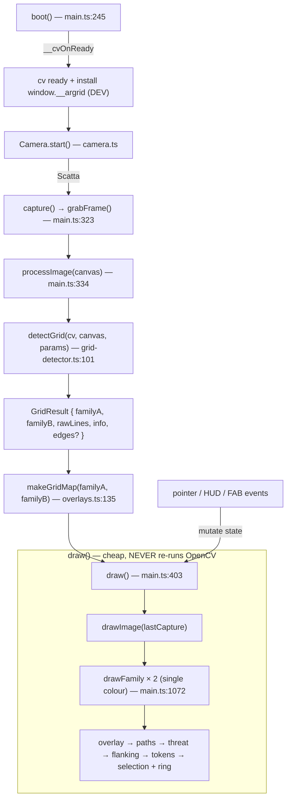

# Architecture

argrid-rpg is a single-page PWA with no framework: `main.ts` wires the DOM, owns all
state, and drives one `<canvas id="view">` on which both the captured photo and every
overlay are drawn (so alignment is exact). OpenCV is used **only** inside
`grid-detector.ts`; everything else is plain TypeScript.

## Module map

| Module | File | Responsibility |
| --- | --- | --- |
| App shell / wiring | `src/main.ts` | DOM refs, all app state, boot, capture, the `draw()` loop, HUD, FAB, pointer gestures, DEV hook. |
| CV pipeline | `src/grid-detector.ts` | Photo → two line families → 2-D lattice reconstruction. Pure data out (image coords); no DOM in the core (`buildGrid`, `detectGridFromMat`). |
| Tactical engine | `src/overlays.ts` | Grid↔image homography + PF2e geometry: distances, area templates, reach/threat, movement search, Pareto routes. Pure functions, unit-tested. |
| Camera | `src/camera.ts` | `getUserMedia` (rear camera) wrapper; `grabFrame()` → canvas at native resolution. |
| Zoom / pan | `src/zoom.ts` | CSS-transform pinch / wheel / drag zoom on the view; `suppress()` hook to freeze pan during a gesture. |
| OpenCV bootstrap | `public/opencv-boot.js` | Classic (non-module) script: fetches `opencv.js` with progress, exposes `window.__cvOnProgress` / `window.__cvOnReady`. |
| Markup / styles | `index.html`, `src/style.css` | App layout, loader, HUD, FAB; PWA shell. |
| Build / PWA | `vite.config.ts` | `__APP_VERSION__` define, `vite-plugin-pwa` (precache incl. ~11 MB `opencv.js`). |

## Runtime data flow

Key point: detection runs **once per capture** (`runDetection` → `detectGrid`,
`main.ts:354`). Every interaction after that — selecting cells, moving pieces,
rotating the angle ring, editing an area — only mutates module state and calls
`draw()` (`main.ts:403`). `draw()` repaints the photo plus the vector overlays; it
does not touch OpenCV. This is what keeps the UI responsive on a phone.

**Reliability gate + manual grid.** After detection, `applyDetectedGrid` sets
`gridReliable` **structurally** (`detectedA,detectedB ≥ 2`, drawn cells per side
`≥ MIN_GRID_CELLS`, `!degenerate`, cell-aspect `≤ MAX_CELL_ASPECT`) — not from a
`confidence` threshold. When it's false, the grid + tactical layer are simply **not**
drawn (the photo shows alone); there is **no** automatic panel. Guidance lives in the
single info **(i)** button (bottom-left), and a top-bar **edit-grid** button opens an
on-demand chooser (`#editChooser`: *grid to adapt* / *draw by hand*) on any result;
**cancel restores the detected grid**. Both manual modes synthesise the same
`familyA`/`familyB` `Line2[]` the detector emits — *adapt* tiles a draggable quad via
the quad→unit-square homography; *draw* traces reference lines fed to `buildGrid` —
and on commit the lattice is extended to fill the frame. So `draw()`, `makeGridMap`
and every tactical tool are agnostic to whether the grid came from CV or the user's
hand. See [decisions.md](decisions.md) ("Unreliable auto grid → photo alone + (i)
guidance + on-demand manual editor").

## Boot path (why a classic script)

OpenCV's Emscripten runtime does **not** initialize when driven from an ES module, so
it is loaded by a **classic** `<script src="/opencv-boot.js">` in `index.html`
(before `src/main.ts`). The bootstrap fetches `opencv.js` with byte progress, injects
it as a blob `<script>`, and signals readiness via a **synchronous** callback
(`cv.onRuntimeInitialized`) exposed as `window.__cvOnReady` — deferring even one
microtask can wedge the main thread. See the header comment block in
`public/opencv-boot.js` and [decisions.md](decisions.md).

`main.ts` `boot()` (`main.ts:245`) subscribes to `window.__cvOnProgress` (loader bar)
and `window.__cvOnReady` (`main.ts:263`); only when ready does it enable capture and
start the camera.

## DEV / test hook — `window.__argrid`

Installed inside the ready callback, guarded by `import.meta.env.DEV` (stripped from
production builds) — `main.ts:268`. A headless browser (Playwright) uses it to drive
detection and the tactical UI on a synthetic canvas. Fields:

| Field | Purpose |
| --- | --- |
| `detectGrid`, `cv`, `DEFAULT_PARAMS` | Run the pipeline directly on a synthetic `<canvas>`. |
| `render(canvas)` | Feed a canvas straight into `processImage()`. |
| `view` | The result `<canvas>` element. |
| `cellClient(i, j)` | Client-space (screen) position of grid node `(i,j)` — to script taps / ring drags. |
| `ringHandle()` | Grid position of the angle-ring tip handle. |
| `effectiveAngle()` | Current snapped line/cone angle. |

See [detection-pipeline.md](detection-pipeline.md) for the CV stages and
[tactical-overlays.md](tactical-overlays.md) for the engine.
